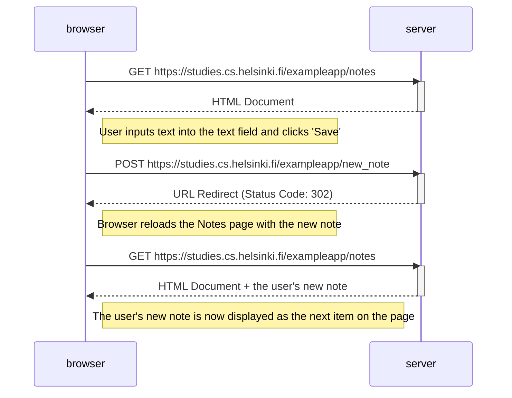

# exercise 0.4

```mermaid
sequenceDiagram
    participant browser
    participant server

    browser->>server: GET https://studies.cs.helsinki.fi/exampleapp/notes
    activate server
    server-->>browser: HTML Document
    deactivate server
    Note right of browser: User inputs text into the text field and clicks 'Save'

    browser->>server: POST https://studies.cs.helsinki.fi/exampleapp/new_note
    activate server
    server-->>browser: URL Redirect (Status Code: 302)
    deactivate server
    Note right of browser: Browser reloads the Notes page with the new note

    browser->>server: GET https://studies.cs.helsinki.fi/exampleapp/notes
    activate server
    server-->>browser: HTML Document + the user's new note
    deactivate server
    Note right of browser: The user's new note is now displayed as the next item on the page
```