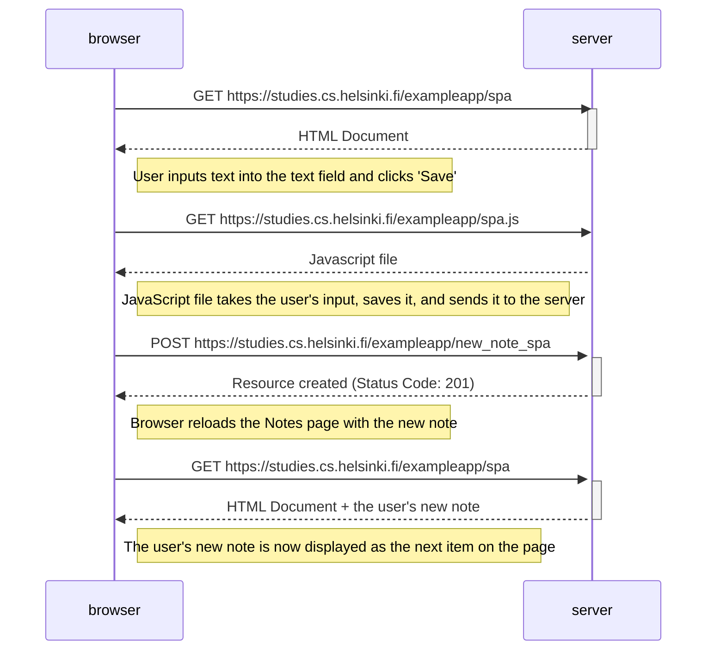

# exercise 0.6

```mermaid
sequenceDiagram
    participant browser
    participant server

    browser->>server: GET https://studies.cs.helsinki.fi/exampleapp/spa
    activate server
    server-->>browser: HTML Document
    deactivate server
    Note right of browser: User inputs text into the text field and clicks 'Save'

    browser->>server: GET https://studies.cs.helsinki.fi/exampleapp/spa.js
    activate server
    server-->>browser: Javascript file
    Note right of browser: JavaScript file takes the user's input, saves it, and sends it to the server

    browser->>server: POST https://studies.cs.helsinki.fi/exampleapp/new_note_spa
    activate server
    server-->>browser: Resource created (Status Code: 201)
    deactivate server
    Note right of browser: Browser reloads the Notes page with the new note

    browser->>server: GET https://studies.cs.helsinki.fi/exampleapp/spa
    activate server
    server-->>browser: HTML Document + the user's new note
    deactivate server
    Note right of browser: The user's new note is now displayed as the next item on the page
```